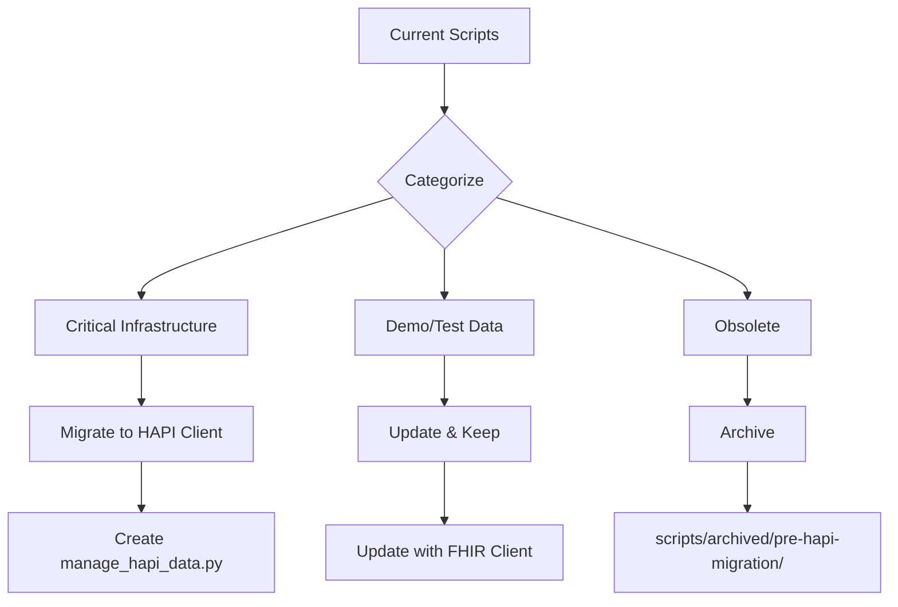

# Phase 3: Active Scripts Analysis - FHIR Migration

**Date**: 2025-10-08
**Status**: Analysis Complete - Awaiting User Decision
**Scope**: Evaluation of scripts in `backend/scripts/active/` and `manage_data.py`

---

## Executive Summary

**48 references** to deprecated `fhir.*` tables remain in active scripts directory. Analysis reveals these scripts fall into three categories:

1. **OBSOLETE** - Functionality now handled by HAPI FHIR → Archive
2. **MIGRATION NEEDED** - Active infrastructure requiring HAPI FHIR update
3. **DEMO/TEST ONLY** - Non-production scripts that can be updated or retained

**Recommendation**: Archive obsolete scripts, migrate critical infrastructure, update demo scripts.

---

## Analysis Results

### Git History - Last Modified Dates

All scripts actively maintained through August 2025:
```
9c4124434 2025-08-06 Cleanup: Remove 56 orphaned and unused backend files
a3b57f589 2025-08-05 Build script updates
deb0c3546 2025-07-26 TypeScript migration
9da9d5a5e 2025-07-18 Clinical workspace refactoring
```

**Conclusion**: Scripts were recently touched, but may still contain deprecated patterns.

### Codebase References

Only **2 files** reference `scripts/active/`:
1. **docker-entrypoint.sh:78** - Informational message only (not executed)
   ```bash
   echo "💡 To generate DICOM files, run: python scripts/active/generate_dicom_for_studies.py"
   ```
2. **manage_data.py:79** - Calls synthea_master.py (which doesn't exist)
   ```python
   cmd = ['python', '/app/scripts/active/synthea_master.py', 'full', '--count', str(count)]
   ```

**Conclusion**: Minimal dependencies on active scripts, safe to modify/archive.

---

## Script-by-Script Analysis

### 🔴 CRITICAL - Requires Migration

#### 1. **manage_data.py** (430 lines, 24+ deprecated table refs)

**Purpose**: Unified data management CLI for loading, indexing, validating, and cleaning patient data

**Deprecated Table Usage**:
- `fhir.resources` - Used in status, validation, cleaning operations
- `fhir.search_params` - Search indexing, reference fixing
- `fhir.resource_history` - Included in clean operation
- `fhir.references` - Reference normalization
- `fhir.compartments` - Compartment population
- `fhir.audit_logs` - Included in clean operation

**Lines with Deprecated References**:
```python
# Line 155-171: fix_references() - fhir.search_params
INSERT INTO fhir.search_params (resource_id, resource_type, param_name...)

# Line 198-348: validate_data(), clean_all_data(), check_status()
SELECT COUNT(*) FROM fhir.resources WHERE resource_type = 'Patient'
SELECT COUNT(*) FROM fhir.search_params
SELECT COUNT(*) FROM fhir.compartments
TRUNCATE TABLE fhir.resources CASCADE
```

**Current Functionality**:
- `load` - Calls non-existent `/app/scripts/active/synthea_master.py`
- `index` - Indexes search parameters (HAPI does automatically)
- `validate` - Validates FHIR data (HAPI provides validation)
- `clean` - Truncates deprecated tables
- `status` - Shows resource counts

**HAPI FHIR Equivalent**:
- ✅ **Data Loading**: Use HAPI FHIR REST API to POST FHIR bundles
- ✅ **Search Indexing**: HAPI auto-indexes on resource create/update
- ✅ **Validation**: HAPI validates against FHIR R4 spec automatically
- ✅ **Status**: Query `hfj_resource` table or use HAPI metadata endpoint
- ✅ **Clean**: Truncate `hfj_*` tables if needed (rare)

**Recommendation**:
```
MIGRATE TO HAPI FHIR CLIENT

Replace with new script: manage_hapi_data.py
- Load: POST Synthea bundles to HAPI FHIR /fhir endpoint
- Validate: Use HAPI's built-in validation
- Status: Query hfj_resource for counts
- Clean: HAPI FHIR provides $expunge operation
```

**Priority**: 🔴 **HIGH** - Referenced by docker documentation, appears to be primary data management tool

---

### 🟡 POSSIBLY OBSOLETE - Verify Usage

#### 2. **consolidated_workflow_setup.py** (29KB, 20 deprecated refs)

**Purpose**: Creates clinical workflow data (order sets, drug interactions, patient-provider assignments)

**Deprecated Table Usage**:
- Direct INSERT into `fhir.resources` for order sets as Questionnaire resources
- Direct INSERT into `fhir.resources` for drug interactions as DocumentReference
- Uses `fhir.search_params` for indexing

**Key Functions**:
- `create_order_sets()` - FHIR Questionnaire resources for clinical workflows
- `create_drug_interactions()` - DocumentReference resources for drug safety
- `link_results_to_orders()` - Connect lab results to orders
- `assign_patients_to_providers()` - Patient-provider relationships

**HAPI FHIR Equivalent**:
- ✅ **Order Sets**: POST Questionnaire resources to `/fhir/Questionnaire`
- ✅ **Drug Interactions**: POST DocumentReference to `/fhir/DocumentReference`
- ✅ **Links**: Use FHIR references in resources, HAPI manages relationships
- ✅ **Assignments**: Use CareTeam resources or PractitionerRole

**Questions for User**:
- ❓ When was this last run in production?
- ❓ Are order sets managed through UI or scripts?
- ❓ Is drug interaction data static or dynamically loaded?

**Recommendation**:
```
IF production use:
  MIGRATE → Use FHIR client to POST resources to HAPI

IF demo/setup only:
  UPDATE → Change to use FHIR client, keep for demo environments

IF obsolete:
  ARCHIVE → Order sets likely managed through UI now
```

**Priority**: 🟡 **MEDIUM** - Determine if actively used

---

#### 3. **consolidated_enhancement.py** (24KB, 18 deprecated refs)

**Purpose**: Enhances patient data with realistic organizations, providers, imaging studies, lab reference ranges

**Deprecated Table Usage**:
- Updates `fhir.resources` directly for Organizations, Practitioners
- Modifies patient name data in-place
- Adds imaging study data
- Enhances lab results with reference ranges

**Key Functions**:
- `enhance_fhir_data()` - Create organizations and providers
- `enhance_imaging()` - Add imaging studies to patients
- `enhance_lab_results()` - Add reference ranges and interpretations

**HAPI FHIR Equivalent**:
- ✅ **Organizations**: POST Organization resources
- ✅ **Practitioners**: POST Practitioner/PractitionerRole resources
- ✅ **Imaging**: POST ImagingStudy and DiagnosticReport resources
- ✅ **Lab Enhancement**: Update Observation resources via PUT

**Questions for User**:
- ❓ Is this for demo data generation or production enhancement?
- ❓ Are organizations/providers managed elsewhere now?

**Recommendation**:
```
IF demo data only:
  UPDATE → Migrate to FHIR client for demo environments

IF production enhancement:
  MIGRATE → Critical migration to HAPI FHIR client

IF replaced by UI:
  ARCHIVE → UI likely handles organization/provider management
```

**Priority**: 🟡 **MEDIUM** - Likely demo/test data generation

---

#### 4. **consolidated_catalog_setup.py** (29KB, 4 deprecated refs)

**Purpose**: Populates clinical catalogs by extracting from existing FHIR data or using static fallbacks

**Deprecated Table Usage** (minimal):
- Queries `fhir.resources` to extract medications, conditions, procedures
- Creates catalog tables (not deprecated)

**Key Functions**:
- `extract_from_fhir()` - Extract unique values from patient data
- `populate_static_catalogs()` - Load fallback catalog data
- `validate_catalogs()` - Verify catalog completeness

**HAPI FHIR Equivalent**:
- ✅ **Extraction**: Query `hfj_resource` or use HAPI search API
- ✅ **Catalog Population**: Same catalog tables, different source

**Questions for User**:
- ❓ Are catalogs built dynamically from patient data?
- ❓ Or are they managed through CatalogExtractor service?

**Recommendation**:
```
CHECK → backend/api/services/clinical/catalog_extractor.py

IF catalog_extractor is used:
  ARCHIVE → Functionality replaced by service

IF still needed:
  MIGRATE → Query hfj_resource instead of fhir.resources
```

**Priority**: 🟢 **LOW** - Only 4 references, likely has service replacement

---

### 🟢 DEMO/UTILITY - Low Priority

#### 5. **demo_catalog_extraction.py** (No deprecated refs ✅)

**Purpose**: Demonstrates catalog extraction using the `CatalogExtractor` service

**Current Implementation**:
```python
from api.services.clinical.catalog_extractor import CatalogExtractor
extractor = CatalogExtractor(session)
extracted_data = await extractor.extract_all_catalogs()
```

**Status**: ✅ **ALREADY MIGRATED** - Uses service layer that queries HAPI FHIR

**Recommendation**: ✅ **KEEP AS-IS** - Demonstrates proper HAPI FHIR usage

**Priority**: ✅ **COMPLETE** - No action needed

---

#### 6-9. **Imaging Scripts** (4 files, 52KB total, 7 deprecated refs)

**Scripts**:
- `generate_dicom_for_studies.py` - Generate DICOM files for ImagingStudy resources
- `generate_imaging_reports.py` - Create DiagnosticReport resources
- `imaging_tools.py` - DICOM manipulation utilities
- `imaging_workflow.py` - Complete imaging workflow

**Deprecated Table Usage**:
- Minimal references to `fhir.resources` for ImagingStudy/DiagnosticReport
- Primarily use `imaging_studies` table (not deprecated)
- Generate DICOM files to filesystem

**Current Status**:
- Referenced in docker-entrypoint.sh (informational only)
- Appear to be standalone utilities for DICOM generation
- Use ImagingToolkit class for DICOM file creation

**HAPI FHIR Equivalent**:
- ✅ **ImagingStudy**: POST to `/fhir/ImagingStudy`
- ✅ **DiagnosticReport**: POST to `/fhir/DiagnosticReport`
- ⚠️ **DICOM Files**: File generation independent of FHIR storage

**Questions for User**:
- ❓ Are these for demo data or production imaging workflows?
- ❓ Is DICOM generation needed for testing/development?

**Recommendation**:
```
IF demo/test only:
  UPDATE → Minimal changes to use HAPI FHIR client
  KEEP → Useful for test data generation

IF production:
  MIGRATE → Update to create resources via HAPI FHIR

IF obsolete:
  ARCHIVE → DICOM handling may be external now
```

**Priority**: 🟢 **LOW** - Appears to be test/development utility

---

## Migration Impact Analysis

### Breaking Changes: ❌ NONE

All scripts are:
- ✅ Standalone utilities (not imported by application code)
- ✅ CLI tools (not used by API endpoints)
- ✅ Optional functionality (not required for system operation)

### Safe Migration Path



---

## Recommended Actions

### Immediate (Based on Analysis)

#### ✅ **Can Archive Now** (No User Input Needed)

**demo_catalog_extraction.py**
- Reason: Already uses HAPI FHIR through service layer
- Action: Keep as-is, it's a good example

#### ❌ **Cannot Proceed Without User Input**

The following require answers to proceed safely:

**manage_data.py**
- Question: Is this actively used for data management?
- If YES: Migrate to HAPI FHIR client (HIGH priority)
- If NO: Archive as obsolete

**consolidated_workflow_setup.py**
- Question: When was this last run? Still needed?
- If PRODUCTION: Migrate to HAPI FHIR client
- If DEMO ONLY: Update and keep for test environments
- If OBSOLETE: Archive

**consolidated_enhancement.py**
- Question: Demo data generation or production use?
- If PRODUCTION: Migrate to HAPI FHIR client
- If DEMO: Update and keep
- If OBSOLETE: Archive

**consolidated_catalog_setup.py**
- Question: Is CatalogExtractor service the replacement?
- If YES: Archive this script
- If NO: Migrate to query hfj_resource

**Imaging Scripts** (4 files)
- Question: Demo/test data or production imaging?
- If DEMO/TEST: Minimal updates, keep for development
- If PRODUCTION: Migrate to HAPI FHIR client
- If OBSOLETE: Archive

---

## Migration Templates

### Template 1: HAPI FHIR Client Pattern

```python
#!/usr/bin/env python3
"""Migrated to use HAPI FHIR Client"""

import httpx
import asyncio
from typing import Dict, Any, List

HAPI_FHIR_BASE_URL = "http://hapi-fhir:8080/fhir"

async def create_resource(resource_type: str, resource: Dict[str, Any]) -> Dict[str, Any]:
    """Create FHIR resource via HAPI FHIR"""
    async with httpx.AsyncClient() as client:
        response = await client.post(
            f"{HAPI_FHIR_BASE_URL}/{resource_type}",
            json=resource,
            headers={"Content-Type": "application/fhir+json"}
        )
        response.raise_for_status()
        return response.json()

async def search_resources(
    resource_type: str,
    params: Dict[str, str]
) -> List[Dict[str, Any]]:
    """Search FHIR resources via HAPI FHIR"""
    async with httpx.AsyncClient() as client:
        response = await client.get(
            f"{HAPI_FHIR_BASE_URL}/{resource_type}",
            params=params
        )
        response.raise_for_status()
        bundle = response.json()
        return [entry["resource"] for entry in bundle.get("entry", [])]

# Example: Replace old pattern
# OLD: INSERT INTO fhir.resources ...
# NEW:
async def create_order_set(order_set_data):
    questionnaire = {
        "resourceType": "Questionnaire",
        "status": "active",
        "title": order_set_data["title"],
        "item": order_set_data["items"]
    }
    return await create_resource("Questionnaire", questionnaire)
```

### Template 2: Data Management (manage_hapi_data.py)

```python
#!/usr/bin/env python3
"""
WintEHR HAPI FHIR Data Management
Replacement for manage_data.py using HAPI FHIR
"""

import asyncio
import httpx
from sqlalchemy.ext.asyncio import create_async_engine, AsyncSession
from sqlalchemy import text

HAPI_FHIR_BASE = "http://hapi-fhir:8080/fhir"

class HAPIDataManager:
    """Manage data using HAPI FHIR instead of direct database access"""

    async def load_patients(self, bundle_file: str):
        """Load FHIR bundle into HAPI FHIR"""
        async with httpx.AsyncClient(timeout=60.0) as client:
            with open(bundle_file) as f:
                bundle = json.load(f)

            response = await client.post(
                f"{HAPI_FHIR_BASE}",
                json=bundle,
                headers={"Content-Type": "application/fhir+json"}
            )
            response.raise_for_status()
            return response.json()

    async def check_status(self):
        """Get HAPI FHIR status and resource counts"""
        # Query hfj_resource instead of fhir.resources
        async with AsyncSession(self.engine) as session:
            result = await session.execute(text("""
                SELECT res_type, COUNT(*) as count
                FROM hfj_resource
                GROUP BY res_type
                ORDER BY count DESC
            """))

            for row in result:
                print(f"{row.res_type}: {row.count}")

    async def clean_all_data(self):
        """Use HAPI FHIR $expunge operation"""
        async with httpx.AsyncClient() as client:
            response = await client.post(
                f"{HAPI_FHIR_BASE}/$expunge",
                json={"resourceType": "Parameters"}
            )
            response.raise_for_status()
```

---

## Testing Strategy

### Phase 3 Testing Plan

1. **Archive Scripts**
   ```bash
   # Move scripts to archived directory
   mkdir -p backend/scripts/archived/pre-hapi-migration/active
   mv backend/scripts/active/obsolete_script.py backend/scripts/archived/pre-hapi-migration/active/
   ```

2. **Test Migrated Scripts**
   ```bash
   # Test new HAPI FHIR data manager
   python backend/scripts/manage_hapi_data.py status
   python backend/scripts/manage_hapi_data.py load --bundle test_bundle.json
   ```

3. **Verify No Dependencies**
   ```bash
   # Ensure nothing imports archived scripts
   grep -r "from scripts.active.obsolete_script" backend/
   grep -r "import scripts.active.obsolete_script" backend/
   ```

4. **Update Documentation**
   - Remove archived script references from README
   - Add new HAPI FHIR script documentation
   - Update deployment guides

---

## Success Criteria

Phase 3 will be complete when:

✅ All scripts either migrated, updated, or archived
✅ Zero active code references to deprecated `fhir.*` tables
✅ HAPI FHIR client patterns used consistently
✅ Documentation updated with HAPI FHIR approach
✅ Testing confirms all functionality works via HAPI FHIR

---

## Questions for User

To proceed with Phase 3, please answer:

### Critical Infrastructure
1. **manage_data.py**
   - [ ] Is this actively used for data management operations?
   - [ ] What operations are run regularly: load, validate, status, clean?
   - [ ] Can we replace with HAPI FHIR client approach?

### Workflow Scripts
2. **consolidated_workflow_setup.py**
   - [ ] When was this last run in production?
   - [ ] Are order sets and drug interactions managed through UI now?
   - [ ] Is this only used for initial setup/demo data?

3. **consolidated_enhancement.py**
   - [ ] Is this for demo data generation or production enhancement?
   - [ ] Are organizations/practitioners managed through UI/API?
   - [ ] Should this be kept for test environment setup?

4. **consolidated_catalog_setup.py**
   - [ ] Is `CatalogExtractor` service the replacement for this?
   - [ ] Are catalogs built dynamically from patient data?
   - [ ] Is static catalog population still needed?

### Imaging Scripts
5. **generate_dicom_for_studies.py, imaging_tools.py, etc.**
   - [ ] Are these for demo/test data or production imaging workflows?
   - [ ] Is DICOM generation needed for development/testing?
   - [ ] Should these be migrated or can they be archived?

---

## Next Steps

**Option 1: User Answers Questions**
→ Proceed with categorized migration based on answers

**Option 2: Conservative Approach**
→ Migrate all scripts to HAPI FHIR, keep functionality intact

**Option 3: Archive All**
→ Archive all active scripts, rely on HAPI FHIR and UI for data management

**Recommended**: Option 1 - Make informed decisions based on actual usage

---

## Appendix: Detailed Reference Counts

### Deprecated Table Reference Breakdown

```
backend/scripts/manage_data.py:
  Line 155-171: fhir.search_params (INSERT for reference fixing)
  Line 198-205: All fhir.* tables (table validation)
  Line 209: fhir.resources (SELECT COUNT)
  Line 218-223: fhir.resources (SELECT by resource_type)
  Line 231-240: fhir.resources, fhir.search_params (search coverage)
  Line 278-285: All fhir.* tables (TRUNCATE CASCADE)
  Line 307: fhir.resources (SELECT COUNT Patient)
  Line 314: fhir.resources (SELECT COUNT total)
  Line 320-323: fhir.resources (COUNT DISTINCT resource_type)
  Line 329: fhir.search_params (SELECT COUNT)
  Line 336: fhir.compartments (SELECT COUNT DISTINCT)
  Line 342-345: fhir.resources (SELECT MAX last_updated)

backend/scripts/active/consolidated_workflow_setup.py: 20 references
backend/scripts/active/consolidated_enhancement.py: 18 references
backend/scripts/active/consolidated_catalog_setup.py: 4 references
backend/scripts/active/generate_dicom_for_studies.py: 4 references
backend/scripts/active/generate_imaging_reports.py: 3 references

TOTAL: 48+ references to deprecated fhir.* tables
```

---

**Document Version**: 1.0
**Last Updated**: 2025-10-08
**Status**: Awaiting User Input to Proceed
