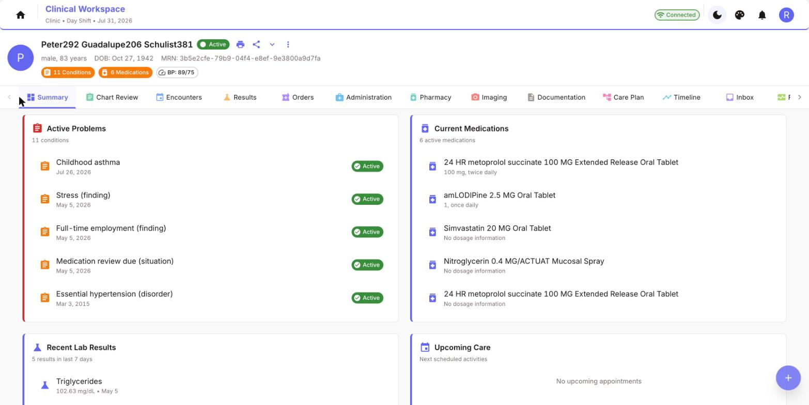
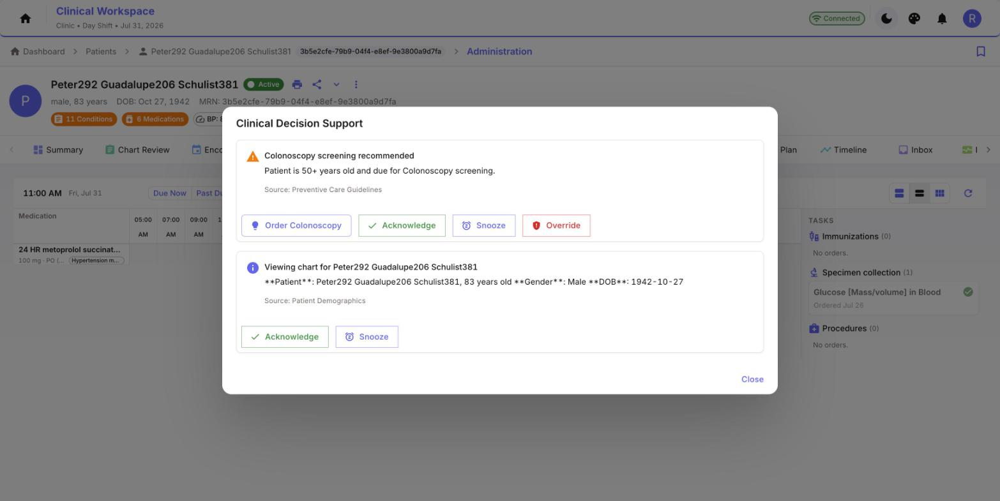
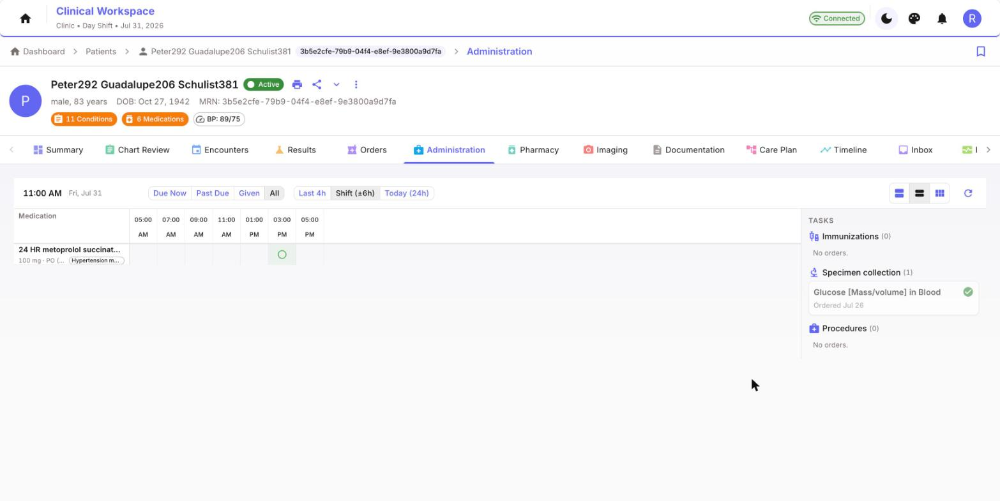
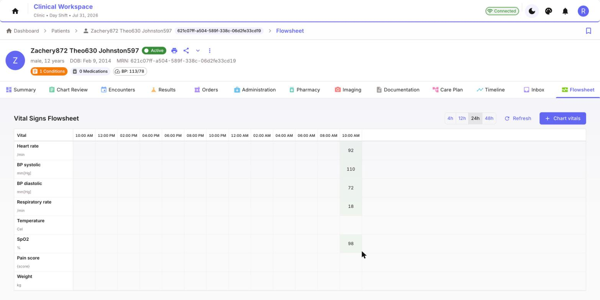

# WintEHR 🩺

**A complete, hackable EHR for learning healthcare IT — FHIR-native, CDS-enabled, and built to be extended.**

> ⚠️ **Educational platform. Synthetic data only.** WintEHR ships with
> [Synthea](https://synthea.mitre.org/)-generated patients, uses deliberately
> simple demo auth, and must **never** hold real patient information.



Most healthcare IT education means reading specs. WintEHR is the other way
around: a fully working EHR where you can place an order and watch the
`MedicationRequest` land in a real HAPI FHIR server, fire a CDS Hook and see
the card interrupt a clinician's workflow, or chart a vital and pull it back
as a LOINC-coded `Observation` — then open the code and see exactly how.

## What's inside

| | Workflow | The standards you'll touch |
|---|---|---|
| 📋 | **Chart Review & Summary** — problems, meds, allergies, vitals, notes | FHIR R4: `Condition`, `AllergyIntolerance`, `Observation` |
| 💊 | **CPOE + Pharmacy + MAR** — order → sign → dispense → administer, with real status gates at every step | `MedicationRequest` → `MedicationDispense` → `MedicationAdministration` |
| 🔔 | **Clinical Decision Support** — cards that interrupt, suggest, and act | CDS Hooks 2.0, CQL, a visual rule builder |
| 🧪 | **Results & Flowsheets** — lab trending, results review, nursing vitals grid | LOINC, `DiagnosticReport`, vital-signs panels |
| 🩻 | **Medical Imaging** — DICOM viewer over a real VNA (dcm4chee) | DICOM, DICOMweb, `ImagingStudy` |
| 🔌 | **SMART on FHIR** — OAuth2/PKCE app launch | SMART App Launch |
| 🏗️ | **Pluggable modules** — add whole clinical domains, or switch them off | see [Extending WintEHR](#extending-wintehr-) |

### A few of the screens

| Decision support in the workflow | Medication administration (MAR) |
|---|---|
|  |  |

| Nursing flowsheet (a pluggable module) |
|---|
|  |

## Quick start 🚀

You'll need Git, Docker + Compose (20.10+), 8 GB RAM, and 20 GB disk.

```bash
git clone https://github.com/ultraub/WintEHR.git
cd WintEHR
./deploy.sh            # first run: 15–25 min (images, DB init, synthetic patients)
./deploy.sh status     # health check
```

| Service | URL | |
|---|---|---|
| Clinical portal | http://localhost:3000 | log in below 👇 |
| FHIR R4 API | http://localhost:8888/fhir | raw HAPI FHIR |
| Backend API | http://localhost:8000/docs | Swagger |

**Demo users** (password is `password` for all): `demo` 🧑‍⚕️ physician ·
`nurse` 💉 nurse · `pharmacist` 💊 pharmacist · `admin` 🔧 administrator

Patient data is regenerated on deploy — break things freely.

## Extending WintEHR 🧩

WintEHR is deliberately built to be built upon. Four ways in, from lightest
to deepest:

1. **Register an external CDS service** — point WintEHR at any CDS Hooks 2.0
   endpoint by URL, at runtime, zero code in this repo. Your service gets
   real hook invocations with prefetched FHIR data.
2. **Write a SMART on FHIR app** — a separate codebase entirely; WintEHR
   provides the OAuth2/PKCE launch and the FHIR API.
3. **Build CDS visually** — CDS Studio composes rules (or CQL) from the UI
   and deploys them as first-class services.
4. **Add a clinical module** — a whole new domain (flowsheets, inpatient,
   oncology…) with its own workspace tab and backend, scaffolded in one
   command:

   ```bash
   python3 scripts/new-module.py referrals "Referrals"
   ```

   A module is one backend directory + one frontend directory sharing a key,
   wired in by three explicit edits, and switchable off per deployment
   (`WINTEHR_DISABLED_MODULES` / `REACT_APP_DISABLED_MODULES`) without
   deleting code. The nursing **Flowsheet** tab in the screenshot above is
   the pilot module — read it as the template. Full contract:
   **[docs/MODULES.md](docs/MODULES.md)**.

## Architecture 🏛️

```
React 18 + MUI ──► FastAPI backend ──► HAPI FHIR JPA (v8.8) ──► PostgreSQL 15
   (Vite 7)        (the "smart          all clinical data          + Redis
                    proxy": CDS,        lives here as FHIR
                    gates, events)      — no custom tables
```

Production-grade parts on purpose — HAPI FHIR is the same server running in
real health systems, so the patterns transfer. Deep dive:
[docs/SYSTEM_ARCHITECTURE.md](docs/SYSTEM_ARCHITECTURE.md).

## Documentation 📚

Everything lives in [`docs/`](docs/INDEX.md). The short list:

| You want to… | Read |
|---|---|
| Deploy it (dev, prod, a client VPC, Azure) | [DEPLOYMENT](docs/DEPLOYMENT.md) · [CLIENT_DEPLOYMENT](docs/CLIENT_DEPLOYMENT.md) · [AZURE_DEPLOYMENT](docs/AZURE_DEPLOYMENT.md) |
| Configure it | [CONFIGURATION](docs/CONFIGURATION.md) |
| Extend it with a module | [MODULES](docs/MODULES.md) |
| Author CDS / CQL | [STUDENT_CQL_PRIMER](docs/STUDENT_CQL_PRIMER.md) |
| Load real terminologies (UMLS) | [TERMINOLOGY_SETUP](docs/TERMINOLOGY_SETUP.md) |
| Understand the security posture | [SECURITY](docs/SECURITY.md) |

For developer-facing architecture context, each major directory carries a
`CLAUDE.md` describing its local patterns and constraints — they double as
excellent orientation for humans and AI coding agents alike.

## For educators 🎓

Classroom demos with real FHIR queries, hands-on labs where students modify
CDS rules or build SMART apps, capstone foundations, self-paced learning.
Synthetic data regenerates on deploy, so nothing students do is permanent.

## Contributing

Contributions welcome — especially ones that raise the educational value.
See [CONTRIBUTING.md](CONTRIBUTING.md).

## License & acknowledgments

Apache 2.0 — see [LICENSE](LICENSE). Standing on the shoulders of
[HL7 FHIR](http://hl7.org/fhir/), [HAPI FHIR](https://hapifhir.io/),
[Synthea](https://synthea.mitre.org/), [CDS Hooks](https://cds-hooks.org/),
and [dcm4chee](https://www.dcm4che.org/).

---

Questions or feedback? [Open an issue](https://github.com/ultraub/WintEHR/issues).
