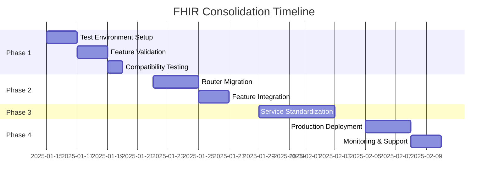

# FHIR Consolidation Strategy

**Version**: 2025-07-15  
**Purpose**: Consolidate and optimize FHIR implementation for production readiness  
**Scope**: Backend FHIR routers, services, and frontend integration

## Executive Summary

The current FHIR implementation has two routers:
1. **fhir_api/router.py** - Clean, active router with basic FHIR R4 operations
2. **api/fhir/fhir_router.py** - Enhanced router with Phase 1-3 features but not mounted

This strategy outlines a phased approach to consolidate these implementations, standardize backend service usage, and ensure production readiness.

## Current State Analysis

### Active Router (fhir_api/router.py)
**Status**: Mounted at `/fhir/R4` in main.py  
**Strengths**:
- Clean architecture
- Basic CRUD operations
- Bundle processing
- Patient/$everything operation
- History support
- Custom FHIRJSONResponse handler

**Gaps**:
- Missing Phase 2-3 features
- No composite search
- No advanced operations
- Limited search parameter support
- No chained searches

### Enhanced Router (api/fhir/fhir_router.py)
**Status**: Not mounted, contains advanced features  
**Strengths**:
- All Phase 1-3 features implemented
- Composite search support
- Advanced query building
- Chained searches
- Include/revinclude
- Full search parameter handling
- Token system search
- Async optimizations

**Risks**:
- Not tested in production
- May have integration issues
- Complex query builder needs validation

### Backend Services
**Issues**:
- Mix of direct storage access and SQL bypasses
- Inconsistent FHIR reference handling
- Some services bypass FHIR storage layer
- Duplicate functionality across services

## Consolidation Strategy

### Phase 1: Prepare and Test (Week 1)
**Objective**: Validate enhanced router functionality without disrupting current system

1. **Create Test Environment**
   - Mount enhanced router at `/fhir/R4-beta` alongside active router
   - Enable A/B testing for gradual migration
   - Set up comprehensive test suite

2. **Validation Tasks**
   - Test all Phase 1-3 features with real Synthea data
   - Validate composite search functionality
   - Test chained searches and includes
   - Verify performance under load

3. **Frontend Compatibility**
   - Create adapter layer if needed
   - Test with existing frontend code
   - Document any API differences

**Deliverables**:
- Test report with pass/fail metrics
- Performance comparison document
- API compatibility matrix

### Phase 2: Feature Migration (Week 2)
**Objective**: Migrate critical features to chosen router

1. **Router Selection**
   - **Recommended**: Use enhanced router as base
   - Rationale: Contains all required features, better architecture
   - Alternative: Port features to active router (more work, less benefit)

2. **Migration Steps**
   ```python
   # Step 1: Move custom FHIRJSONResponse from active to enhanced
   # Step 2: Ensure all endpoint paths match exactly
   # Step 3: Migrate any custom operations
   # Step 4: Update import paths in main.py
   ```

3. **Feature Checklist**
   - [x] Basic CRUD operations
   - [x] Bundle processing
   - [x] History support
   - [x] Search operations
   - [ ] Composite search (test)
   - [ ] Chained search (test)
   - [ ] Include/revinclude (test)
   - [ ] Token system search (test)

**Deliverables**:
- Unified router with all features
- Migration guide
- Rollback plan

### Phase 3: Backend Service Standardization (Week 3)
**Objective**: Ensure all services use FHIR storage consistently

1. **Service Audit**
   ```python
   # Services to review:
   - PharmacyService
   - ClinicalTaskService  
   - NotesService
   - OrdersService
   - DynamicCatalogService
   ```

2. **Standardization Rules**
   - All FHIR operations MUST use FHIRStorageEngine
   - No direct SQL queries for FHIR resources
   - Use consistent reference handling
   - Implement proper error handling

3. **Code Patterns**
   ```python
   # Good Pattern
   async def get_resource(self, resource_type: str, resource_id: str):
       return await self.storage.read_resource(resource_type, resource_id)
   
   # Bad Pattern - Direct SQL
   query = "SELECT * FROM fhir.resources WHERE..."
   ```

**Deliverables**:
- Refactored services
- Service integration tests
- Performance metrics

### Phase 4: Production Deployment (Week 4)
**Objective**: Deploy consolidated solution with zero downtime

1. **Pre-deployment**
   - Full backup of FHIR database
   - Load testing with production data
   - Security audit
   - Documentation review

2. **Deployment Strategy**
   - Blue-green deployment
   - Feature flags for gradual rollout
   - Real-time monitoring
   - Automated rollback triggers

3. **Post-deployment**
   - Monitor error rates
   - Track performance metrics
   - Gather user feedback
   - Address any issues

**Deliverables**:
- Deployment checklist
- Monitoring dashboard
- Incident response plan

## Risk Mitigation

### Technical Risks
| Risk | Impact | Mitigation |
|------|--------|------------|
| API Breaking Changes | High | Maintain compatibility layer during transition |
| Performance Degradation | Medium | Load test before deployment, optimize queries |
| Data Corruption | High | Comprehensive backups, transaction rollbacks |
| Frontend Integration Issues | Medium | Extensive integration testing, gradual rollout |

### Mitigation Strategies
1. **Parallel Running**: Keep both routers active during transition
2. **Feature Flags**: Control feature rollout per user/tenant
3. **Comprehensive Testing**: Automated test suite covering all scenarios
4. **Rollback Plan**: One-command rollback with data preservation

## Testing Strategy

### Unit Tests
```python
# Test all FHIR operations
- test_create_resource()
- test_read_resource()
- test_update_resource()
- test_delete_resource()
- test_search_operations()
- test_composite_search()
- test_chained_search()
```

### Integration Tests
```python
# Test cross-service interactions
- test_pharmacy_workflow()
- test_order_to_result_flow()
- test_clinical_documentation()
- test_bundle_processing()
```

### Performance Tests
- Load test with 10,000+ resources
- Concurrent user simulation
- Search operation benchmarks
- Bundle processing limits

### Security Tests
- Authentication/authorization
- Input validation
- SQL injection prevention
- CORS configuration

## Documentation Requirements

### Technical Documentation
1. **API Reference**
   - All endpoints with examples
   - Search parameter documentation
   - Operation definitions
   - Error code reference

2. **Integration Guide**
   - Frontend integration patterns
   - Service integration examples
   - WebSocket event handling
   - Authentication flows

3. **Migration Guide**
   - Step-by-step migration instructions
   - Code change examples
   - Troubleshooting guide
   - Rollback procedures

### User Documentation
1. **Release Notes**
   - New features
   - Breaking changes
   - Performance improvements
   - Bug fixes

2. **Training Materials**
   - Video tutorials
   - Quick start guides
   - Best practices
   - FAQ

## Success Metrics

### Technical Metrics
- API response time < 200ms (p95)
- Search operations < 500ms (p95)
- Bundle processing < 2s for 100 resources
- Zero data loss during migration
- 99.9% uptime maintained

### Business Metrics
- No disruption to clinical workflows
- Improved developer experience
- Reduced support tickets
- Faster feature development

## Implementation Timeline



## Recommended Approach

**Primary Recommendation**: Adopt the enhanced router (api/fhir/fhir_router.py) as the consolidated solution.

**Rationale**:
1. Contains all required Phase 1-3 features
2. Better architecture for future extensions
3. Already implements complex search operations
4. Supports all FHIR R4 requirements

**Alternative Approach**: Port features to active router
- Pros: Less disruption, gradual migration
- Cons: More development effort, potential inconsistencies

## Next Steps

1. **Immediate Actions**
   - Review and approve this strategy
   - Allocate development resources
   - Set up test environment
   - Begin Phase 1 validation

2. **Communication**
   - Notify all stakeholders
   - Schedule migration windows
   - Prepare user communications
   - Plan training sessions

3. **Monitoring**
   - Set up migration dashboard
   - Configure alerts
   - Establish success criteria
   - Plan review meetings

## Appendices

### A. Feature Comparison Matrix
| Feature | Active Router | Enhanced Router | Priority |
|---------|--------------|-----------------|----------|
| Basic CRUD | ✅ | ✅ | High |
| Bundle Processing | ✅ | ✅ | High |
| Search | ✅ Basic | ✅ Advanced | High |
| Composite Search | ❌ | ✅ | Medium |
| Chained Search | ❌ | ✅ | Medium |
| Include/Revinclude | ❌ | ✅ | Low |
| Token System Search | ❌ | ✅ | High |
| Async Operations | ❌ | ✅ | Medium |

### B. Risk Register
| ID | Risk | Probability | Impact | Mitigation |
|----|------|-------------|--------|------------|
| R1 | API Breaking Changes | Medium | High | Compatibility layer |
| R2 | Performance Issues | Low | High | Load testing |
| R3 | Data Loss | Low | Critical | Backups, transactions |
| R4 | Frontend Bugs | Medium | Medium | Integration tests |

### C. Technical Debt Items
1. Remove duplicate router implementations
2. Standardize error handling across services
3. Implement consistent logging
4. Update all service documentation
5. Remove SQL bypass patterns

---

**Document Status**: DRAFT  
**Next Review**: 2025-01-17  
**Owner**: FHIR Architecture Team