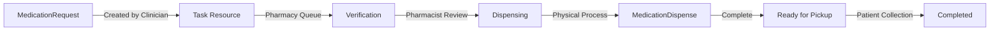

# Pharmacy Module Design Document

## Overview
This document outlines the comprehensive design for the MedGenEMR Pharmacy Module, which provides a dual-approach system integrating seamlessly with the Clinical Workspace while offering a standalone interface for dedicated pharmacy staff.

## Design Principles

### 1. FHIR-Native Architecture
- All operations utilize FHIR R4 resources:
  - `MedicationRequest` - Prescriptions from clinicians
  - `MedicationDispense` - Completed dispensing records
  - `Task` - Queue management and workflow tracking
- Ensures interoperability and standards compliance

### 2. Workflow Integration
- Seamless connection between prescribing (Clinical Workspace) and dispensing (Pharmacy)
- Real-time updates via `ClinicalWorkflowContext`
- Event-driven architecture for cross-module communication

### 3. Educational Focus
- Clear visual workflow states that teach pharmacy processes
- Tooltips and best practice alerts
- Visual indicators for special handling requirements

### 4. Simple & Intuitive Interface
- Kanban-style board with drag-and-drop functionality
- Color-coded priority system
- Quick action buttons for common tasks

## Architecture: Hybrid Approach

### Clinical Workspace Integration (Patient-Centric)
**Location**: `/clinical/{patientId}` - PharmacyTab  
**Users**: Clinicians, Nurses  
**Purpose**: Monitor patient-specific medication status and dispensing history

**Features**:
- Read-only view of patient's medication queue
- Dispensing status timeline
- Quick action: "Send to Pharmacy"
- Pickup reminders and adherence tracking

### Standalone Pharmacy Page (System-Wide)
**Location**: `/pharmacy` - Main menu item  
**Users**: Pharmacists, Pharmacy Technicians  
**Purpose**: Manage all prescriptions across all patients

**Features**:
- Full CRUD operations on medication queue
- Drag-and-drop queue management
- Inventory integration (mock initially)
- Batch operations and verification tools

## User Interface Design

### Pharmacy Queue Layout
```
┌─────────────────────────────────────────────────────────────────┐
│  🏥 Pharmacy Queue Management                          [Stats]   │
├─────────────────────────────────────────────────────────────────┤
│  [Search] [Filter: All] [Priority: All] [Date Range] [Actions]  │
├─────────────────────────────────────────────────────────────────┤
│  ┌─────────────┬──────────────┬────────────┬─────────────────┐ │
│  │ New Orders  │ Verification │ Dispensing │ Ready for Pickup│ │
│  │    📋 12    │     ✓ 5      │    💊 3    │      📦 8       │ │
│  ├─────────────┼──────────────┼────────────┼─────────────────┤ │
│  │[Rx Cards]   │[Rx Cards]    │[Rx Cards]  │[Rx Cards]      │ │
│  │ Draggable   │ Draggable    │ Draggable  │ Draggable      │ │
│  └─────────────┴──────────────┴────────────┴─────────────────┘ │
│  [Quick Actions: Verify All | Print Labels | Check Inventory]   │
└─────────────────────────────────────────────────────────────────┘
```

### Prescription Card Design
```
┌─────────────────────────────────────┐
│ [Priority Color]  [Time: 15 min]    │
├─────────────────────────────────────┤
│ 👤 John Smith (DOB: 1950-01-15)    │
│ 📋 MRN: 12345                       │
├─────────────────────────────────────┤
│ 💊 Lisinopril 10mg                  │
│ 📝 Take 1 tablet daily              │
│ 📦 Qty: 30 | Days: 30               │
├─────────────────────────────────────┤
│ 👨‍⚕️ Dr. Johnson | 📅 Today 2:30 PM  │
├─────────────────────────────────────┤
│ [Verify] [Dispense] [More ⋮]       │
└─────────────────────────────────────┘
```

## Workflow States

### 1. New Orders
- **Source**: MedicationRequest with status='active'
- **Actions**: Review, Verify, Flag for clarification
- **Auto-priority**: Based on medication type and wait time
- **Color**: Yellow/Warning

### 2. Verification
- **Process**: Drug interaction check, dosage verification, insurance check
- **Actions**: Approve, Request clarification, Check inventory
- **Educational**: Shows verification checklist
- **Color**: Blue/Info

### 3. Dispensing
- **Process**: Physical medication preparation
- **Actions**: Complete dispensing, Print label, Add notes
- **Features**: Lot number entry, expiration date tracking
- **Color**: Purple/Primary

### 4. Ready for Pickup
- **Status**: Completed and verified
- **Actions**: Mark as picked up, Send reminder, Print receipt
- **Tracking**: Time in ready queue, pickup reminders sent
- **Color**: Green/Success

## FHIR Resource Flow



## Integration Points

### Clinical Workflow Events
```javascript
// Event Types
MEDICATION_PRESCRIBED    // New prescription created
MEDICATION_VERIFIED      // Passed pharmacist review
MEDICATION_DISPENSED     // Physical dispensing complete
MEDICATION_COLLECTED     // Patient picked up medication

// Event Flow Example
ChartReviewTab → Creates MedicationRequest
  ↓ Publishes MEDICATION_PRESCRIBED
PharmacyQueue → Receives event, adds to "New Orders"
  ↓ Pharmacist verifies
PharmacyQueue → Publishes MEDICATION_VERIFIED
  ↓ Technician dispenses
PharmacyQueue → Publishes MEDICATION_DISPENSED
  ↓ Updates ChartReviewTab status
Patient Portal → Shows "Ready for Pickup" notification
```

### API Endpoints
- `GET /api/clinical/pharmacy/queue` - Retrieve pharmacy queue
- `POST /api/clinical/pharmacy/dispense` - Create MedicationDispense
- `PUT /api/clinical/pharmacy/status/{id}` - Update queue status
- `GET /api/clinical/pharmacy/metrics` - Queue analytics
- `GET /api/clinical/pharmacy/inventory/check/{code}` - Check stock

## Smart Features

### 1. Auto-Priority Algorithm
```javascript
Priority = Base + TimeWeight + MedicationWeight + PatientWeight

Where:
- Base: All start at priority 3 (normal)
- TimeWeight: +1 for every hour in queue
- MedicationWeight: 
  - Antibiotics: +2
  - Pain medications: +1
  - Maintenance meds: 0
- PatientWeight:
  - Elderly (>65): +1
  - Pediatric (<18): +1
```

### 2. Drug Interaction Checking
- Simple rule-based system initially
- Checks against patient's current medications
- Alerts for major interactions only
- Educational tooltips explain interactions

### 3. Inventory Integration (Mock)
```javascript
{
  medicationCode: "lisinopril-10mg",
  currentStock: 500,
  reorderPoint: 100,
  expiringLots: [
    { lot: "LOT123", qty: 50, expires: "2024-03-01" }
  ],
  dailyUsage: 25
}
```

### 4. Batch Operations
- Select multiple prescriptions of same medication
- Verify/dispense as group
- Efficiency metrics tracking

## Educational Elements

### 1. Workflow Stage Descriptions
- **New Orders**: "Review prescription for completeness and appropriateness"
- **Verification**: "Check for drug interactions, allergies, and proper dosing"
- **Dispensing**: "Select correct medication, verify strength, count accurately"
- **Ready**: "Ensure proper labeling and patient counseling materials included"

### 2. Visual Indicators
- 🧊 Refrigerated medication (blue background)
- ⚠️ High-alert medication (red border)
- 🔒 Controlled substance (lock icon)
- ⏰ Urgent/Stat order (flashing border)

### 3. Best Practice Alerts
- "This patient has 3 medications due for refill - consider sync"
- "New medication - counseling recommended"
- "Generic substitution available"

## Performance Considerations

### 1. Queue Optimization
- Virtual scrolling for queues >50 items
- Pagination with infinite scroll
- Client-side filtering and sorting

### 2. Real-Time Updates
- WebSocket connections for live updates
- Optimistic UI updates for drag operations
- Conflict resolution for simultaneous edits

### 3. Caching Strategy
- Cache medication database locally
- Prefetch common patient data
- Background sync for inventory levels

## Security & Compliance

### 1. Role-Based Access
- Pharmacists: Full access to all queues
- Technicians: Limited to verification and dispensing
- Clinicians: Read-only access via Clinical Workspace

### 2. Audit Trail
- All status changes logged with timestamp and user
- Medication dispense records immutable
- Integration with system-wide audit trail

### 3. HIPAA Compliance
- Patient data encrypted in transit and at rest
- Automatic logout after inactivity
- Minimum necessary data displayed

## Future Enhancements

### Phase 2 (3-6 months)
- Real inventory system integration
- Automated refill management
- Insurance verification API
- Patient text notifications

### Phase 3 (6-12 months)
- AI-powered interaction checking
- Predictive queue management
- Mobile app for pharmacists
- Integration with robotics/automation

### Phase 4 (12+ months)
- Multi-site pharmacy network
- Centralized fill optimization
- Advanced analytics dashboard
- Telepharmacy capabilities

## Success Metrics

### Efficiency Metrics
- Average time per prescription: <2 minutes
- Queue processing time: <30 minutes
- First-time accuracy rate: >99%

### User Experience Metrics
- Drag-drop success rate: >95%
- Page load time: <2 seconds
- Real-time update latency: <1 second

### Clinical Metrics
- Medication error rate: <0.1%
- Patient wait time: <15 minutes
- Prescription clarification rate: <5%

## Implementation Timeline

### Week 1-2: Foundation
- Remove Clinical Workspace from menu
- Create basic PharmacyPage structure
- Implement queue visualization

### Week 3-4: Core Features
- Drag-and-drop functionality
- FHIR resource integration
- Basic dispensing workflow

### Week 5-6: Integration
- Clinical Workflow event system
- Real-time updates
- Enhanced PharmacyTab in Clinical Workspace

### Week 7-8: Polish & Testing
- Educational features
- Performance optimization
- User acceptance testing

## Technical Stack

### Frontend
- React 18+ with Hooks
- Material-UI v5
- react-beautiful-dnd for drag-and-drop
- recharts for analytics
- date-fns for time calculations

### State Management
- FHIRResourceContext for data
- ClinicalWorkflowContext for events
- Local state for UI interactions

### Backend
- FastAPI with existing endpoints
- PostgreSQL FHIR storage
- WebSocket for real-time updates

## Conclusion

This pharmacy module design balances innovation with practicality, creating a system that's both educational for training environments and robust enough for production use. The dual-approach architecture ensures that both clinicians and pharmacy staff have optimized interfaces for their specific workflows while maintaining seamless data integration through FHIR standards.