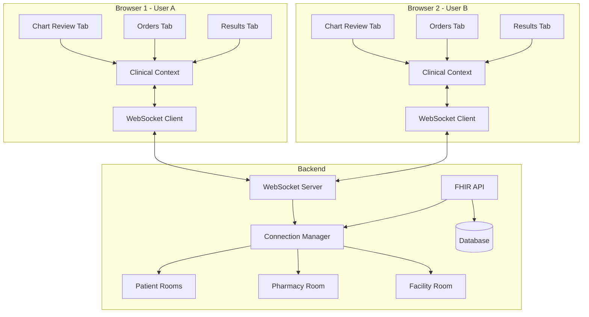
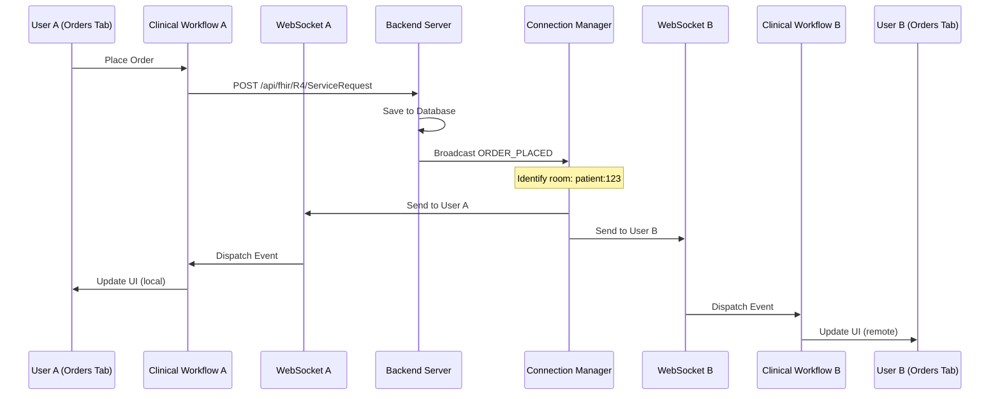

# Real-Time Updates Architecture

## System Overview



## Event Flow Diagram



## Component Architecture

### Frontend Components

```
┌─────────────────────────────────────────────────┐
│                Clinical Component                │
├─────────────────────────────────────────────────┤
│  State Management                               │
│  - Local State (useState)                       │
│  - Resource Data                                │
│  - UI State                                     │
├─────────────────────────────────────────────────┤
│  Real-Time Subscriptions                        │
│  - Clinical Event Subscriptions (useEffect)     │
│  - WebSocket Room Subscriptions (useEffect)     │
│  - Event Handlers (useCallback)                 │
├─────────────────────────────────────────────────┤
│  Update Logic                                   │
│  - Incremental State Updates                    │
│  - No Full Refresh                              │
│  - Optimistic Updates                           │
└─────────────────────────────────────────────────┘
```

### Event Types and Routing

| Event Category | Events | Room Type | Components |
|----------------|--------|-----------|------------|
| Orders | ORDER_PLACED, ORDER_UPDATED, ORDER_CANCELLED | patient:{id} | Orders Tab, Timeline |
| Results | RESULT_AVAILABLE, CRITICAL_VALUE_ALERT | patient:{id} | Results Tab, Header |
| Medications | MEDICATION_PRESCRIBED, MEDICATION_DISPENSED | patient:{id}, pharmacy:queue | Chart Review, Pharmacy |
| Alerts | CLINICAL_ALERT_TRIGGERED, ALERT_ACKNOWLEDGED | patient:{id}, facility:alerts | Header, Alert Banner |
| Documents | NOTE_CREATED, NOTE_SIGNED | patient:{id} | Documentation Tab |

## WebSocket Message Format

### Subscription Message
```json
{
  "type": "subscription",
  "data": {
    "subscription_id": "sub-user1-abc123",
    "patient_ids": ["patient-123"],
    "resource_types": ["ServiceRequest", "DiagnosticReport"]
  }
}
```

### Update Message (from Backend)
```json
{
  "type": "update",
  "data": {
    "action": "created",
    "resource_type": "ServiceRequest",
    "resource_id": "order-456",
    "patient_id": "patient-123",
    "event_type": "ORDER_PLACED",
    "resource": {
      "resourceType": "ServiceRequest",
      "id": "order-456",
      "status": "active",
      "intent": "order",
      "subject": {"reference": "Patient/patient-123"},
      "code": {"text": "CBC with Differential"},
      "authoredOn": "2025-08-04T10:30:00Z"
    }
  }
}
```

### Clinical Event (Frontend)
```json
{
  "eventType": "ORDER_PLACED",
  "patientId": "patient-123",
  "orderId": "order-456",
  "order": {/* ServiceRequest resource */},
  "userId": "user-1",
  "timestamp": "2025-08-04T10:30:00Z",
  "fromWebSocket": false
}
```

## Room Architecture

### Patient Rooms
- Pattern: `patient:{patientId}`
- Purpose: All updates for a specific patient
- Subscribers: Any user viewing that patient
- Events: All patient-specific clinical events

### Pharmacy Room
- Pattern: `pharmacy:queue`
- Purpose: Pharmacy-wide prescription queue
- Subscribers: All pharmacy staff
- Events: MEDICATION_PRESCRIBED, PRESCRIPTION_VERIFIED, MEDICATION_DISPENSED

### Unit/Ward Rooms (Future)
- Pattern: `unit:{unitId}`
- Purpose: Unit-specific updates
- Subscribers: Staff assigned to unit
- Events: Admissions, transfers, alerts

### Facility Room (Future)
- Pattern: `facility:alerts`
- Purpose: Hospital-wide alerts
- Subscribers: All active users
- Events: Emergency alerts, system notices

## State Management Patterns

### Incremental Updates
```javascript
// Adding new items
setState(prev => [newItem, ...prev]);

// Updating existing items
setState(prev => prev.map(item => 
  item.id === updated.id ? updated : item
));

// Removing items
setState(prev => prev.filter(item => item.id !== deletedId));

// Moving between lists (e.g., pharmacy queue)
setQueues(prev => ({
  ...prev,
  sourceQueue: prev.sourceQueue.filter(item => item.id !== movedId),
  targetQueue: [movedItem, ...prev.targetQueue]
}));
```

### Preventing Duplicate Updates
```javascript
// Check if update is from WebSocket to prevent loops
const handleUpdate = (event, data) => {
  // Skip if this client initiated the change
  if (data.userId === currentUser.id && !data.fromWebSocket) {
    return;
  }
  
  // Apply update
  applyUpdate(data);
};
```

## Performance Optimization

### Connection Pooling
- Maximum connections per user: 1
- Automatic reconnection with exponential backoff
- Message queuing during disconnection
- Heartbeat every 30 seconds

### Event Debouncing
```javascript
// For high-frequency updates
const debouncedVitalsUpdate = useMemo(
  () => debounce((vitals) => {
    setVitals(vitals);
  }, 500),
  []
);
```

### Subscription Management
```javascript
// Subscribe only to needed resource types
const resourceTypes = useMemo(() => {
  switch (activeTab) {
    case 'orders': return ['ServiceRequest', 'MedicationRequest'];
    case 'results': return ['Observation', 'DiagnosticReport'];
    default: return [];
  }
}, [activeTab]);
```

## Security Considerations

### Authentication
- WebSocket connections require valid JWT token
- Token passed as query parameter on connection
- Automatic disconnection on token expiration

### Authorization
- Users only receive updates for patients they have access to
- Room subscriptions validated against user permissions
- Sensitive data filtered based on user role

### Audit Trail
```python
# Backend audit logging
async def broadcast_update(resource_type, resource_id, action, user_id):
    # Log the broadcast
    await audit_log.create({
        "event": "realtime_update_broadcast",
        "resource_type": resource_type,
        "resource_id": resource_id,
        "action": action,
        "user_id": user_id,
        "timestamp": datetime.utcnow()
    })
```

## Monitoring and Metrics

### Key Metrics
1. **Connection Health**
   - Active WebSocket connections
   - Connection duration
   - Reconnection frequency

2. **Message Performance**
   - Message delivery latency
   - Message delivery success rate
   - Messages per second

3. **Room Statistics**
   - Active rooms
   - Subscribers per room
   - Message broadcast efficiency

### Debug Tools
```javascript
// Development mode debugging
if (process.env.NODE_ENV === 'development') {
  window.__REALTIME_DEBUG__ = {
    connections: websocketService.getConnectionState(),
    subscriptions: getActiveSubscriptions(),
    messageLog: getRecentMessages(100)
  };
}
```

---

**Related Documentation**:
- [Multi-User Sync Implementation](./MULTI_USER_SYNC_IMPLEMENTATION.md)
- [Real-Time Updates Analysis](./REAL_TIME_UPDATES_ANALYSIS.md)
- [Implementation Guide](./REAL_TIME_UPDATES_IMPLEMENTATION_GUIDE.md)