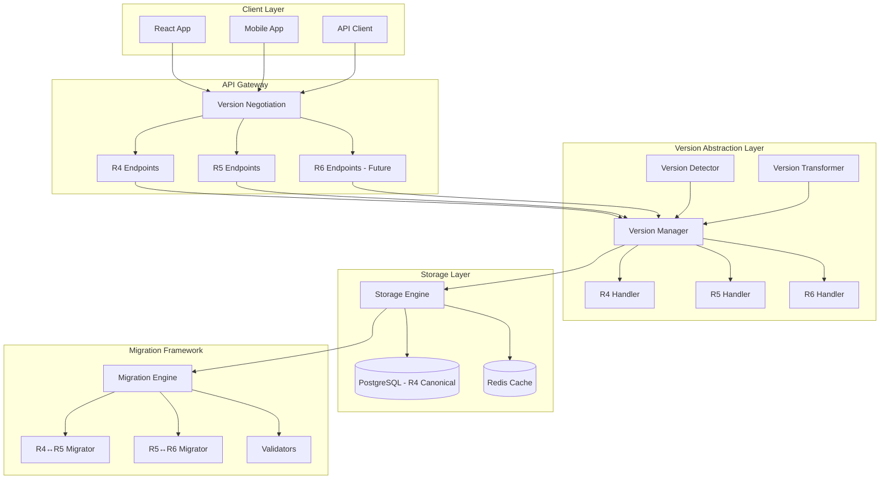

# FHIR Multi-Version Architecture

**Created**: 2025-01-10  
**Status**: Design Document  
**Version**: 1.0

## Architecture Overview



## Core Components

### 1. Version Detection
```python
# Automatic version detection from multiple sources
Version Detection Priority:
1. Explicit version in Accept header
2. _format parameter with fhirVersion
3. Meta.profile analysis
4. Resource structure analysis
5. Default to R4
```

### 2. Version Transformation Pipeline
```
Request Flow:
Client Request → Version Detection → Input Validation → Transform to R4 → 
Storage → Transform to Output Version → Response

Key Points:
- All data stored in R4 canonical format
- Bidirectional transformations for all versions
- Lazy transformation with caching
- Original version preserved in meta
```

### 3. Storage Strategy
```sql
-- Resource table enhancements
ALTER TABLE fhir_resources ADD COLUMN original_version VARCHAR(10);
ALTER TABLE fhir_resources ADD COLUMN version_metadata JSONB;

-- Version-specific indexes
CREATE INDEX idx_fhir_version ON fhir_resources(original_version);
CREATE INDEX idx_version_meta ON fhir_resources USING GIN(version_metadata);
```

### 4. API Version Routing
```
/fhir/R4/Patient/{id}  → R4 Handler → Storage → R4 Response
/fhir/R5/Patient/{id}  → R5 Handler → Storage → R5 Transform → R5 Response
/fhir/Patient/{id}     → Version Negotiation → Appropriate Handler
```

## Version Differences Matrix

### Patient Resource Changes
| Feature | R4 | R5 | R6 (Draft) |
|---------|----|----|------------|
| contact.relationship | Coding[] | CodeableConcept[] | CodeableConcept[] |
| deceased[x] | boolean/dateTime | boolean/dateTime | boolean/dateTime/Age |
| maritalStatus | CodeableConcept | CodeableConcept | CodeableConcept[] |
| photo | Attachment[] | Attachment[] | Attachment[] + metadata |
| link | Patient.Link[] | Patient.Link[] | RelatedPerson reference |

### Observation Resource Changes
| Feature | R4 | R5 | R6 (Draft) |
|---------|----|----|------------|
| category | CodeableConcept[] | CodeableConcept[] | Required |
| interpretation | CodeableConcept[] | CodeableConcept[] | CodeableConcept[] + narrative |
| component | Component[] | Component[] | Component[] + relationships |
| triggeredBy | - | Reference[] | Reference[] |

### Breaking Changes Handling
```python
# Example: R4 to R5 Patient contact transformation
def transform_patient_contact_r4_to_r5(contact):
    if 'relationship' in contact:
        # R4: relationship is Coding[]
        # R5: relationship is CodeableConcept[]
        contact['relationship'] = [{
            'coding': contact['relationship']
        }]
    return contact

# Example: R5 to R4 Patient contact transformation  
def transform_patient_contact_r5_to_r4(contact):
    if 'relationship' in contact:
        # Extract first coding from CodeableConcept
        if contact['relationship'] and 'coding' in contact['relationship'][0]:
            contact['relationship'] = contact['relationship'][0]['coding']
    return contact
```

## Performance Considerations

### Caching Strategy
```python
Cache Layers:
1. CDN: Static FHIR resources (terminology, profiles)
2. Redis: Transformed resources (TTL: 1 hour)
3. Application: Version handlers and schemas
4. Database: Query results cache

Cache Key Format:
{resource_type}:{id}:{version}:{hash}
```

### Optimization Techniques
1. **Lazy Transformation**: Only transform when requested
2. **Batch Processing**: Transform multiple resources together
3. **Streaming**: Large bundles streamed with transformation
4. **Pre-computation**: Common transformations pre-computed

## Migration Scenarios

### Scenario 1: Upgrade System from R4 to R5
```bash
# Step 1: Analyze impact
python migrate_fhir_versions.py analyze --from R4 --to R5

# Step 2: Test migration
python migrate_fhir_versions.py test --from R4 --to R5 --sample-size 100

# Step 3: Backup
pg_dump medgenemr > backup_before_r5.sql

# Step 4: Migrate with monitoring
python migrate_fhir_versions.py execute --from R4 --to R5 --batch-size 1000
```

### Scenario 2: Mixed Version Environment
```python
# Client A: Requests R4
GET /fhir/Patient/123
Accept: application/fhir+json; fhirVersion=4.0

# Client B: Requests R5  
GET /fhir/Patient/123
Accept: application/fhir+json; fhirVersion=5.0

# Both served from same R4 storage with appropriate transformation
```

### Scenario 3: Gradual Migration
```python
Migration Phases:
1. Enable multi-version support (no data changes)
2. Start accepting R5 writes (transform to R4 storage)
3. Migrate existing data in batches
4. Update clients to use R5
5. Deprecate R4 endpoints (optional)
```

## Security Considerations

### Version-Specific Validation
```python
Security Checks by Version:
- R4: Standard OAuth2 scopes
- R5: Enhanced granular scopes
- R6: Attribute-based access control

# Validate based on requested version
validator = get_validator(requested_version)
validator.validate_access(resource, user_context)
```

### Audit Trail
```json
{
  "timestamp": "2025-01-10T10:30:00Z",
  "user": "clinician-123",
  "action": "read",
  "resource": "Patient/456",
  "requested_version": "R5",
  "stored_version": "R4",
  "transformation_applied": true,
  "client_info": {...}
}
```

## Testing Strategy

### Unit Tests
```python
# Test each transformation
def test_patient_r4_to_r5():
    r4_patient = load_fixture('patient_r4.json')
    r5_patient = transform_r4_to_r5(r4_patient)
    assert validate_r5(r5_patient)

# Test round-trip transformations
def test_observation_round_trip():
    original = load_fixture('observation_r5.json')
    r4_version = transform_r5_to_r4(original)
    back_to_r5 = transform_r4_to_r5(r4_version)
    assert_equivalent(original, back_to_r5)
```

### Integration Tests
```python
# Test version negotiation
def test_version_negotiation():
    # R4 request
    response = client.get('/fhir/Patient/123', 
                         headers={'Accept': 'application/fhir+json; fhirVersion=4.0'})
    assert response.headers['Content-Type'] == 'application/fhir+json; fhirVersion=4.0.1'
    
    # R5 request same resource
    response = client.get('/fhir/Patient/123',
                         headers={'Accept': 'application/fhir+json; fhirVersion=5.0'})
    assert response.headers['Content-Type'] == 'application/fhir+json; fhirVersion=5.0.0'
```

### Performance Tests
```python
# Measure transformation overhead
def test_transformation_performance():
    patients = load_patients(1000)
    
    start = time.time()
    for patient in patients:
        transform_r4_to_r5(patient)
    duration = time.time() - start
    
    assert duration < 1.0  # Less than 1ms per resource
```

## Deployment Strategy

### Phase 1: Foundation (Week 1-2)
- Deploy version abstraction layer
- Enable version detection
- Add version metadata to storage

### Phase 2: R5 Support (Week 3-4)
- Deploy R5 handlers and transformers
- Enable R5 endpoints
- Begin accepting R5 requests

### Phase 3: Migration Tools (Week 5)
- Deploy migration framework
- Test bulk migrations
- Create rollback procedures

### Phase 4: Full Rollout (Week 6)
- Enable for all clients
- Monitor performance
- Optimize based on usage

## Monitoring & Metrics

### Key Metrics
```python
Metrics to Track:
- version_requests_total{version, resource_type}
- transformation_duration_seconds{from_version, to_version}
- transformation_errors_total{from_version, to_version, error_type}
- cache_hit_rate{version, resource_type}
- storage_version_distribution{version}
```

### Dashboards
1. **Version Usage**: Track adoption of different FHIR versions
2. **Performance**: Transformation times and cache effectiveness
3. **Errors**: Version-specific errors and validation failures
4. **Migration Progress**: Track bulk migration status

## Future Considerations

### FHIR R6 Preparation
```python
R6 Considerations:
- GraphQL support native
- Enhanced subscription model
- Improved terminology services
- Advanced consent management

# Extensible architecture ready for R6
class FHIRR6Handler(FHIRVersionHandler):
    # Implementation when R6 is released
    pass
```

### Long-term Strategy
1. **Version Sunset Policy**: Define R4 deprecation timeline
2. **Client Migration Path**: Tools to help clients upgrade
3. **Feature Parity**: Ensure all features work across versions
4. **Performance Goals**: Sub-millisecond transformations

## Conclusion

This multi-version FHIR architecture provides:
- ✅ Seamless support for R4, R5, and future R6
- ✅ Zero-downtime migration capabilities
- ✅ Performance-optimized transformations
- ✅ Comprehensive validation and compliance
- ✅ Future-proof extensibility

The architecture maintains backward compatibility while enabling forward progress, ensuring MedGenEMR can serve diverse client needs across the FHIR version spectrum.