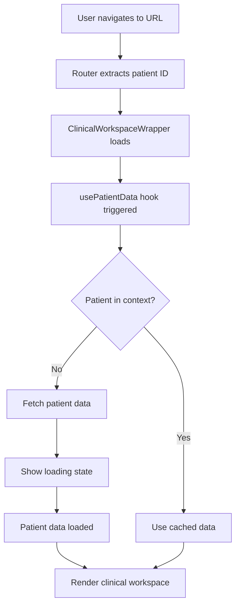

# Direct Patient Navigation Feature

**Date Implemented**: 2025-01-23  
**Version**: 1.0.0

## Overview

WintEHR now supports direct navigation to a patient's clinical workspace using the patient UID in the URL. This allows users to:
- Bookmark specific patient pages
- Share patient links with colleagues
- Navigate directly to a patient without going through the patient list
- Deep link to specific clinical tabs

## URL Format

```
http://localhost:3000/patients/{patient-id}/clinical?tab={tab-name}
```

### Examples:
```
# Navigate to patient's chart review
http://localhost:3000/patients/0288c42c-43a1-9878-4a9d-6b96caa12c40/clinical?tab=chart-review

# Navigate to patient's results
http://localhost:3000/patients/0288c42c-43a1-9878-4a9d-6b96caa12c40/clinical?tab=results

# Navigate to patient's orders
http://localhost:3000/patients/0288c42c-43a1-9878-4a9d-6b96caa12c40/clinical?tab=orders
```

### Available Tabs:
- `summary` - Patient summary dashboard
- `chart-review` - Clinical chart review
- `encounters` - Visit history
- `results` - Lab results
- `orders` - Clinical orders
- `pharmacy` - Medications
- `imaging` - Medical imaging
- `documentation` - Clinical documents
- `care-plan` - Care plans and goals
- `timeline` - Clinical timeline

## Technical Implementation

### Key Components Modified:

1. **usePatientData Hook** (`/frontend/src/hooks/usePatientData.js`)
   - Handles async patient loading when navigating directly
   - Manages loading states during initial patient fetch
   - Provides derived data for immediate use

2. **ClinicalWorkspaceEnhanced** (`/frontend/src/components/clinical/ClinicalWorkspaceEnhanced.js`)
   - Shows loading UI while patient data is being fetched
   - Handles error cases with retry options
   - Supports direct navigation without pre-loaded context

3. **EnhancedClinicalLayout** (`/frontend/src/components/clinical/layouts/EnhancedClinicalLayout.js`)
   - Shows patient header even during loading
   - Maintains UI consistency during async operations

### Data Flow:



## User Experience

### Loading State:
When navigating directly to a patient URL, users see:
1. Loading spinner
2. "Loading Patient Data..." message
3. Patient ID being loaded
4. Collapsible patient header in skeleton state

### Error Handling:
If patient loading fails, users see:
1. Clear error message
2. Retry button to attempt loading again
3. "Back to Patient List" button for navigation

### Success State:
Once loaded, users have full access to:
1. Complete patient clinical workspace
2. All clinical tabs with patient data
3. Normal navigation and functionality

## Security Considerations

- Patient IDs in URLs are encoded using the existing FHIR ID encoding system
- Authentication is still required (ProtectedRoute wrapper)
- No sensitive patient data is exposed in the URL
- Standard authorization checks apply

## Browser Support

- ✅ Chrome/Edge (latest)
- ✅ Firefox (latest)
- ✅ Safari (latest)
- ✅ Mobile browsers

## Performance

- Initial load time: ~1-2 seconds (depending on patient data size)
- Subsequent navigation: Instant (cached data)
- Bundle size impact: Minimal (reuses existing components)

## Testing

### Manual Testing:
1. Copy a patient URL from the browser
2. Open a new tab/window
3. Paste the URL and navigate
4. Verify patient loads correctly

### Automated Testing:
```javascript
// Example test case
it('should load patient directly from URL', async () => {
  const patientId = '0288c42c-43a1-9878-4a9d-6b96caa12c40';
  const { getByText } = render(
    <MemoryRouter initialEntries={[`/patients/${patientId}/clinical`]}>
      <App />
    </MemoryRouter>
  );
  
  // Should show loading state
  expect(getByText(/Loading Patient Data/i)).toBeInTheDocument();
  
  // Wait for patient to load
  await waitFor(() => {
    expect(getByText(/Smith, John/i)).toBeInTheDocument();
  });
});
```

## Known Limitations

1. Patient ID must be valid and exist in the system
2. User must be authenticated
3. Network connectivity required for initial load

## Future Enhancements

1. **Offline Support**: Cache patient data for offline access
2. **Preloading**: Prefetch patient data based on navigation patterns
3. **URL Shortcuts**: Support shorter URLs with patient aliases
4. **Smart Routing**: Redirect to most relevant tab based on user role

## Migration Notes

No migration required. This feature is backwards compatible and doesn't affect existing navigation patterns. Users can continue navigating from the patient list as before.

## Related Documentation

- [Clinical Workspace Guide](../modules/clinical-workspace.md)
- [Navigation Patterns](../patterns/navigation.md)
- [Patient Context Management](../architecture/patient-context.md)