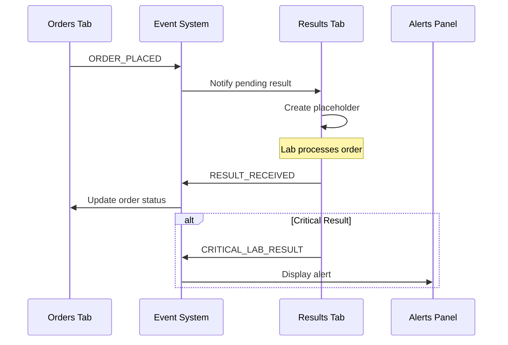
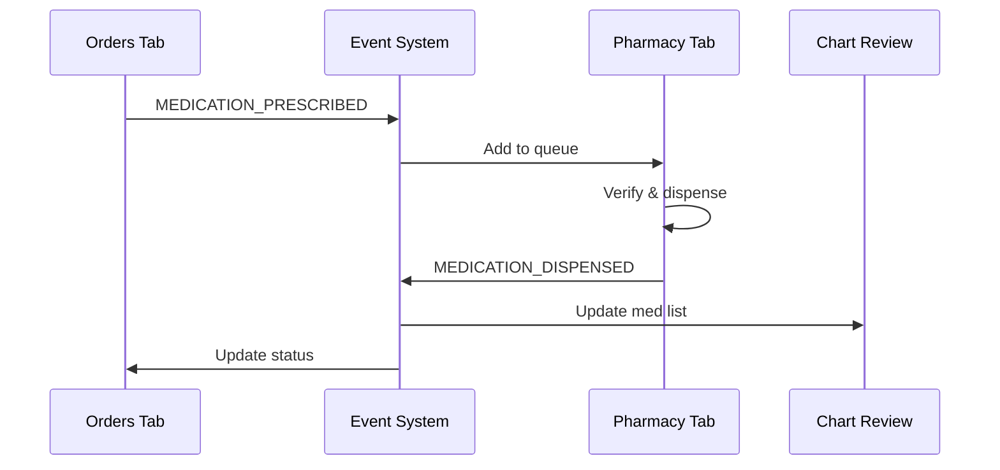

# Cross-Module Integration Guide

## Overview
This guide documents the clinical workflow event system that enables seamless communication between different modules in WintEHR.

## Core Integration Patterns

### 1. Event-Driven Architecture
All clinical modules communicate through a centralized event system managed by `ClinicalWorkflowContext`.

```javascript
import { useClinicalWorkflow, CLINICAL_EVENTS } from '../../contexts/ClinicalWorkflowContext';

// Publishing an event
const { publish } = useClinicalWorkflow();
await publish(CLINICAL_EVENTS.ORDER_PLACED, orderData);

// Subscribing to events
const { subscribe } = useClinicalWorkflow();
useEffect(() => {
  const unsubscribe = subscribe(CLINICAL_EVENTS.ORDER_PLACED, handleOrderPlaced);
  return unsubscribe;
}, []);
```

### 2. Clinical Event Types
```javascript
export const CLINICAL_EVENTS = {
  // Order Management
  ORDER_PLACED: 'order_placed',
  ORDER_UPDATED: 'order_updated',
  ORDER_CANCELLED: 'order_cancelled',
  ORDER_SIGNED: 'order_signed',
  
  // Results
  RESULT_RECEIVED: 'result_received',
  CRITICAL_LAB_RESULT: 'critical_lab_result',
  
  // Medications
  MEDICATION_PRESCRIBED: 'medication_prescribed',
  MEDICATION_DISPENSED: 'medication_dispensed',
  MEDICATION_DISCONTINUED: 'medication_discontinued',
  
  // Documentation
  NOTE_CREATED: 'note_created',
  NOTE_UPDATED: 'note_updated',
  NOTE_SIGNED: 'note_signed',
  NOTE_ADDENDUM_ADDED: 'note_addendum_added',
  
  // Encounters
  ENCOUNTER_CREATED: 'encounter_created',
  ENCOUNTER_UPDATED: 'encounter_updated',
  ENCOUNTER_CLOSED: 'encounter_closed',
  
  // Allergies
  ALLERGY_ADDED: 'allergy_added',
  ALLERGY_UPDATED: 'allergy_updated',
  ALLERGY_REMOVED: 'allergy_removed',
  
  // Problems
  PROBLEM_ADDED: 'problem_added',
  PROBLEM_UPDATED: 'problem_updated',
  PROBLEM_RESOLVED: 'problem_resolved'
};
```

## Integration Workflows

### Order-to-Result Flow


### Prescription-to-Dispense Flow


## Implementation Examples

### 1. Orders Module Integration
```javascript
// OrdersTab.js
const OrdersTab = () => {
  const { publish, subscribe } = useClinicalWorkflow();
  
  // Publish when order is placed
  const handlePlaceOrder = async (orderData) => {
    const savedOrder = await fhirClient.create('ServiceRequest', orderData);
    
    await publish(CLINICAL_EVENTS.ORDER_PLACED, {
      orderId: savedOrder.id,
      type: orderData.category?.[0]?.coding?.[0]?.code,
      patient: patientId,
      code: orderData.code?.coding?.[0]?.code,
      display: orderData.code?.text
    });
  };
  
  // Subscribe to result updates
  useEffect(() => {
    const unsubscribe = subscribe(CLINICAL_EVENTS.RESULT_RECEIVED, (data) => {
      if (data.orderId) {
        // Update order status in UI
        refreshOrders();
      }
    });
    return unsubscribe;
  }, []);
};
```

### 2. Results Module Integration
```javascript
// ResultsTab.js
const ResultsTab = () => {
  const { publish, subscribe } = useClinicalWorkflow();
  
  // Subscribe to new orders
  useEffect(() => {
    const unsubscribe = subscribe(CLINICAL_EVENTS.ORDER_PLACED, async (data) => {
      if (data.type === 'laboratory') {
        // Create pending result placeholder
        await createPendingResult(data);
      }
    });
    return unsubscribe;
  }, []);
  
  // Publish when result is received
  const handleResultReceived = async (observation) => {
    await publish(CLINICAL_EVENTS.RESULT_RECEIVED, {
      orderId: observation.basedOn?.[0]?.reference?.split('/')[1],
      observationId: observation.id,
      status: observation.status,
      value: observation.valueQuantity?.value,
      unit: observation.valueQuantity?.unit,
      interpretation: observation.interpretation?.[0]?.coding?.[0]?.code
    });
    
    // Check for critical values
    if (isCritical(observation)) {
      await publish(CLINICAL_EVENTS.CRITICAL_LAB_RESULT, {
        observationId: observation.id,
        patientId,
        code: observation.code?.coding?.[0]?.display,
        value: observation.valueQuantity?.value,
        unit: observation.valueQuantity?.unit,
        interpretation: 'critical',
        message: getCriticalMessage(observation)
      });
    }
  };
};
```

### 3. Pharmacy Module Integration
```javascript
// PharmacyTab.js
const PharmacyTab = () => {
  const { publish, subscribe } = useClinicalWorkflow();
  
  // Subscribe to new prescriptions
  useEffect(() => {
    const unsubscribe = subscribe(CLINICAL_EVENTS.MEDICATION_PRESCRIBED, (data) => {
      // Add to pharmacy queue
      refreshPharmacyQueue();
    });
    return unsubscribe;
  }, []);
  
  // Publish when medication is dispensed
  const handleDispense = async (medicationRequest, dispenseData) => {
    const dispense = await fhirClient.create('MedicationDispense', dispenseData);
    
    await publish(CLINICAL_EVENTS.MEDICATION_DISPENSED, {
      medicationRequestId: medicationRequest.id,
      medicationDispenseId: dispense.id,
      status: 'completed',
      quantity: dispenseData.quantity,
      daysSupply: dispenseData.daysSupply
    });
  };
};
```

## Best Practices

### 1. Event Data Structure
Always include essential identifiers and context:
```javascript
// Good
await publish(CLINICAL_EVENTS.ORDER_PLACED, {
  orderId: order.id,
  patientId: patient.id,
  type: 'laboratory',
  priority: order.priority,
  timestamp: new Date().toISOString()
});

// Bad - missing context
await publish(CLINICAL_EVENTS.ORDER_PLACED, order.id);
```

### 2. Error Handling
Wrap event publishing in try-catch:
```javascript
try {
  await publish(CLINICAL_EVENTS.ORDER_PLACED, orderData);
} catch (error) {
  console.error('Failed to publish order event:', error);
  // Handle gracefully - don't break the UI
}
```

### 3. Subscription Cleanup
Always clean up subscriptions:
```javascript
useEffect(() => {
  const unsubscribe = subscribe(CLINICAL_EVENTS.ORDER_PLACED, handler);
  return unsubscribe; // Critical!
}, [dependencies]);
```

### 4. Event Naming Conventions
- Use UPPER_SNAKE_CASE for event constants
- Use past tense for completed actions (ORDER_PLACED, not PLACE_ORDER)
- Be specific (MEDICATION_DISPENSED, not MEDICATION_UPDATED)

## Testing Integration

### Unit Testing Events
```javascript
test('publishes ORDER_PLACED event when order is created', async () => {
  const { result } = renderHook(() => useClinicalWorkflow());
  const mockOrder = { id: '123', type: 'laboratory' };
  
  let receivedEvent = null;
  act(() => {
    result.current.subscribe(CLINICAL_EVENTS.ORDER_PLACED, (data) => {
      receivedEvent = data;
    });
  });
  
  await act(async () => {
    await result.current.publish(CLINICAL_EVENTS.ORDER_PLACED, mockOrder);
  });
  
  expect(receivedEvent).toEqual(mockOrder);
});
```

### Integration Testing
See `/frontend/src/tests/integration/clinicalWorkflowIntegration.test.js` for comprehensive integration tests.

## Troubleshooting

### Common Issues

1. **Events not received**
   - Check subscription is set up before event is published
   - Verify event name matches exactly
   - Ensure component is mounted

2. **Memory leaks**
   - Always return unsubscribe function in useEffect
   - Check for multiple subscriptions to same event

3. **Race conditions**
   - Use proper async/await
   - Consider event ordering
   - Add appropriate delays in tests

### Debug Mode
Enable event logging:
```javascript
// In development
if (process.env.NODE_ENV === 'development') {
  window.DEBUG_CLINICAL_EVENTS = true;
}
```

## Future Enhancements

1. **Event Replay**: Ability to replay events for debugging
2. **Event Filtering**: Subscribe to events with filters
3. **Event Batching**: Batch multiple events for performance
4. **Event Persistence**: Store events for audit trail
5. **Event Analytics**: Track event patterns for insights

---

Last Updated: 2025-01-12